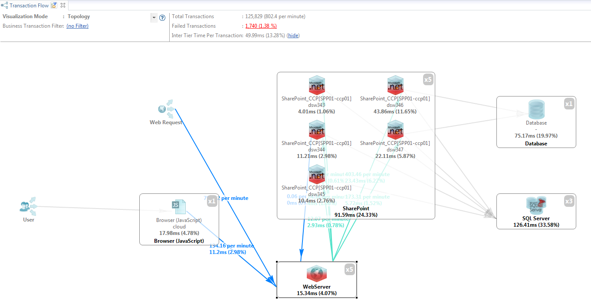
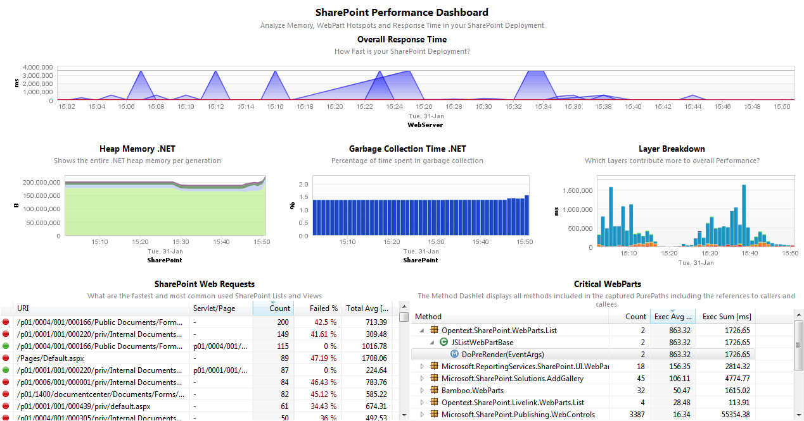
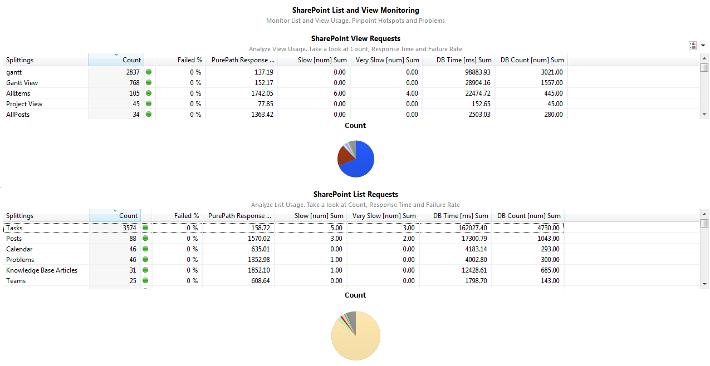

# SharePoint FastPack

## Overview

 The dynaTrace FastPack for the Microsoft SharePoint (both Windows SharePoint
Services and Microsoft Office Share Server) enables faster analysis of SharePoint Applications by providing specific Sensor Packs and Dashboards to identify problems in custom WebParts, SharePoint
Lists & Views, usage of CAML, ...

## FastPack Details

| Name | Microsoft SharePoint FastPack
| :--- | :---
| Author | Andreas Grabner (andreas.grabner@dynatrace.com)
| Supported dynaTrace Version | >=5.5
| Supported SharePoint Version | Tested with SharePoint 2007, 2010 and 2013
| License | [dynaTrace BSD](dynaTraceBSD.txt)
| Support | [Community Supported](https://community.compuwareapm.com/community/display/DL/Support+Levels#SupportLevels-Community+Supported)  
| Download | [SharePoint FastPack for dynaTrace 6.x](SharePointFastPack.dt60.dtp)
|| [SharePoint FastPack for dynaTrace 4.x + 5.x](SharePointFastPack.dt41.dtp)

## SharePoint Performance Dashboard

The Performance Dashboard highlights the most interesting performance aspects of a SharePoint Deployment:

  * _Overall Response Time_ shows you whether you have any general Performance Issues 

  * _Memory and Gargabe Collection_ allows you to see whether you need to allocate more memory for your SharePoint Application Pools or whether you have any memory leaks 

  * _Layer Breakdown_ gives you a quick indication on the Application Layers that are the main performance contributors, e.g: ADO.NET indicates that your SharePoint App is too heavy on the Database. ASP.NET WebParts means you want to optimize WebPart Usage. 

  * _SharePoint WebRequests_ shows which pages are requests, which ones have problems and which ones are fast or slow 

  * _Critial WebParts_ highlights those WebParts that have a high performance contribution 

## SharePoint Usage Dashboard

The Usage Dashboard helps you to understand which Lists and Views are heavily used and which ones may indicate a problem, e.g: too much load on a List results in high error rates or long response
times. In order to answer these questions simply sort the View or List Response Table by Count, Failed % or Response Time.

## Package Information

On the **dynaTrace Blog** the following posts give a good overview of the FastPack and give additional hints about problematic areas in SharePoint applications:

  * [dynaTrace SharePoint Fast Pack](http://apmblog.compuware.com/2009/04/15/dynatrace-sharepoint-package-available-on-community-portal/)

  * [5 Top Performance Problems in SharePoint](http://apmblog.compuware.com/2010/03/18/how-to-avoid-the-top-5-sharepoint-performance-mistakes/)

The Download Package includes everything you need to manage SharePoint Applications:

  * Pre-Configured System Profile **SharePoint** including a Deep-Dive and Memory Sensor Group to be enabled by Developers in Pre-Prod Environments 

  * 2 Dashboards for Usage and Performance Monitoring 

## Installation

Follow the following Steps:

  1. Import the [SharePoint FastPack](attachments_71073855_1_SharePointFastPack.dt41.dtp) into your dynaTrace Server. For details on how to do this please refer to the [Online Documentation on Plugin Management](https://community.compuwareapm.com/community/display/DOCDT41/Plugin+Management). 

  2. Configure your SharePoint Application Agents to use the name "SharePoint" using the [.NET Agent Configuration](https://community.compuwareapm.com/community/display/DOCDT41/.NET+Agent+Configuration) Tool on your SharePoint Servers. 

  3. (optional): If you also have dynaTrace UEM configure your IIS Web Server to use the name "WebServer_SharePoint". More information on [Microsoft IIS Web Server Agent Configuration](https://community.compuwareapm.com/community/display/DOCDT41/Microsoft+IIS+Web+Server+Agent+Configuration)

